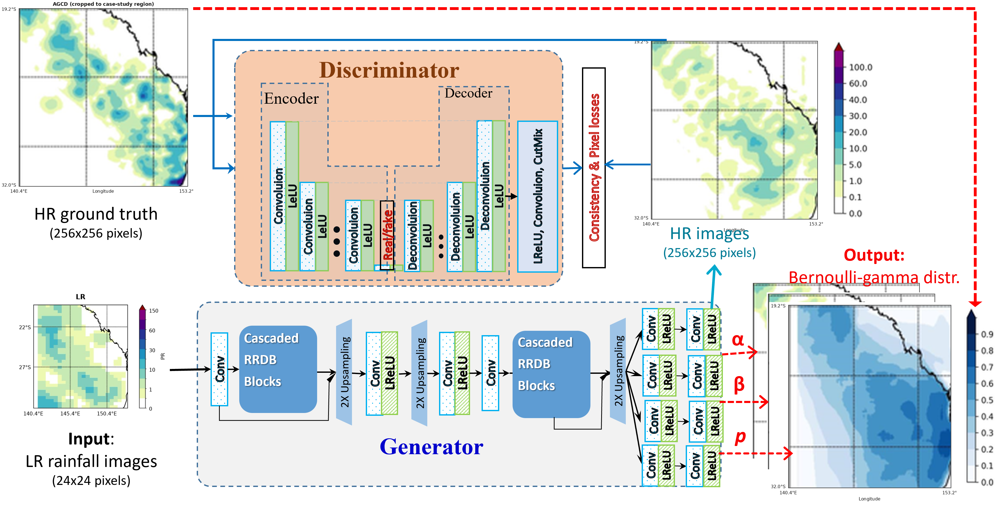
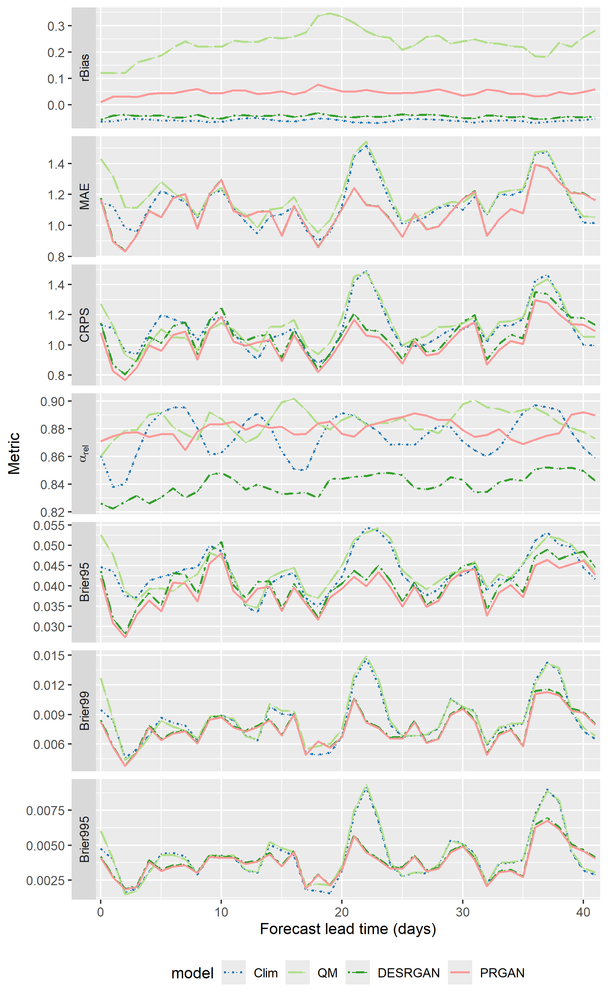
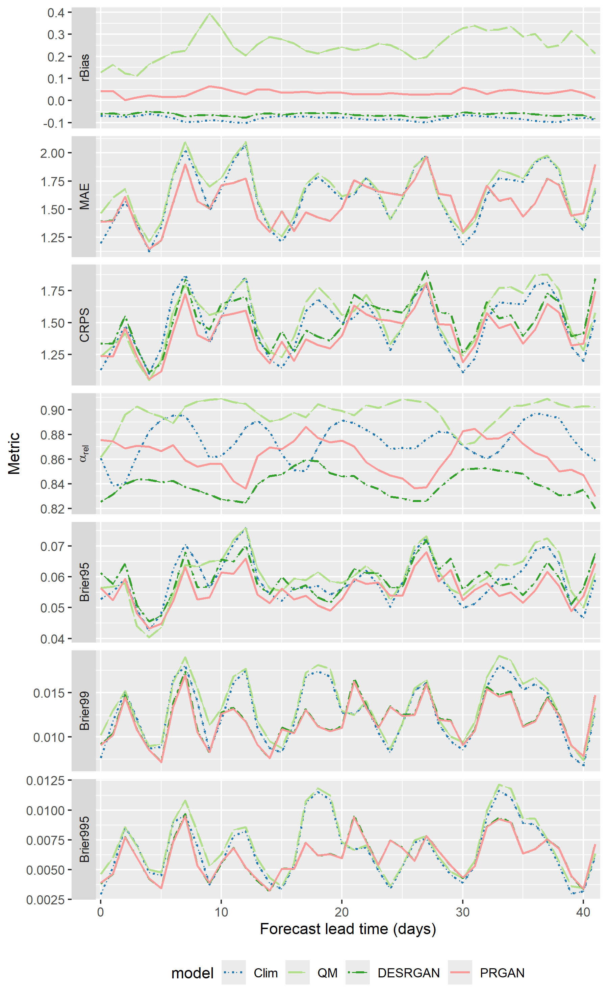
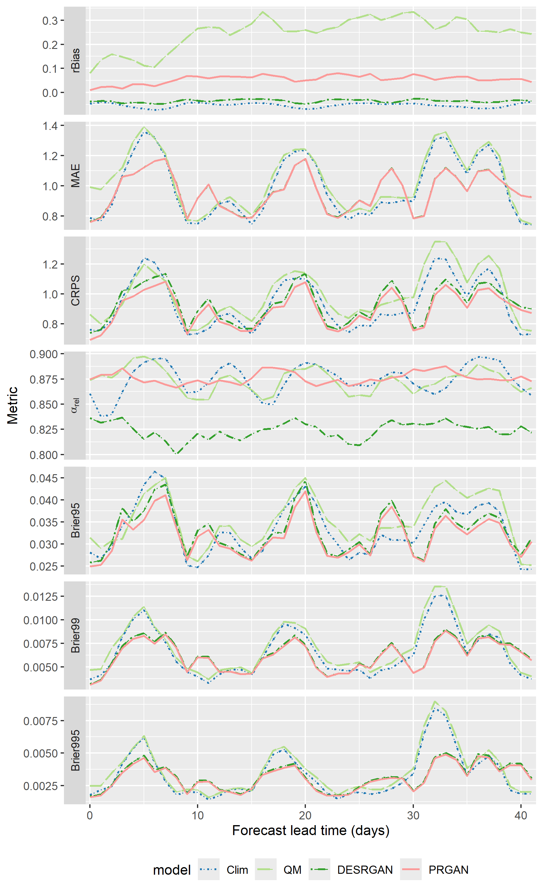

# PRGAN: Probabilistic Downscaling of Seasonal Rainfall Forecasts with Improved Extreme-Event Skill

PRGAN is a probabilistic deep-learning framework for statistical downscaling of subseasonal-to-seasonal daily rainfall forecasts. It converts coarse-resolution raw ACCESS-S2 ensemble forecasts into kilometre-scale predictive rainfall distributions over Eastern Australia, mainly Queensland.

Unlike deterministic super-resolution models like DESRGAN or VDSD, PRGAN predicts an explicit Bernoulli-Gamma distribution at every 5 km grid cell. This provides rain-occurrence probabilities, conditional rainfall amounts, and threshold-exceedance probabilities in a single forward pass.

## Highlights

- Downscales approximately 60 km ACCESS-S2 rainfall forecasts to the 5 km AGCD observational grid.
- Processes nine ensemble members and lead times from 1 to 42 days.
- Represents zero-inflated daily rainfall with a Bernoulli-Gamma predictive distribution.
- Uses cascaded Residual-in-Residual Dense Blocks (RRDBs) for spatial refinement.
- Uses a U-Net discriminator to encourage realistic rainfall structure at pixel and image scales.
- Separates spatial learning and probabilistic calibration through two-stage training.
- Evaluates PRGAN against DESRGAN, quantile mapping (QM), and climatology.
- Includes deterministic, probabilistic, reliability, and extreme-rainfall verification metrics.

## Method

### Model architecture



The generator progressively upsamples coarse ACCESS-S2 rainfall through cascaded RRDB blocks and produces spatial fields for rain probability \(p\), Gamma shape \(\alpha\), and Gamma scale \(\beta\). During adversarial pretraining, the U-Net discriminator compares generated high-resolution rainfall with cropped AGCD observations and supplies consistency and pixel-level losses.

For rainfall amount \(R\), PRGAN uses a mixed distribution consisting of a point mass at zero and a Gamma distribution for wet days:

$$
P(R = 0) = 1-p, \qquad R \mid R>0 \sim \mathrm{Gamma}(\alpha, \beta).
$$

The three spatial output fields are transformed into valid distribution parameters as

$$
p=\sigma(z_p), \qquad \alpha=\exp(z_\alpha), \qquad \beta=\exp(z_\beta).
$$

The repository can also generate a deterministic rainfall estimate using the predicted wet-day decision and conditional Gamma mean:

$$
\widehat{R}=\mathbf{1}_{\{p>0.5\}}\,\alpha\beta.
$$

### Two-stage training

1. **Adversarial pretraining.** The DESRGAN backbone learns realistic fine-scale rainfall structure using the RRDB generator and U-Net discriminator.
2. **Distributional fine-tuning.** The generator is adapted to output \(p\), \(\alpha\), and \(\beta\), then fine-tuned using Bernoulli-Gamma negative log-likelihood.

This separation avoids asking a single objective to learn spatial texture, rain occurrence, and positive-rainfall intensity simultaneously from the beginning.

## Data and experimental setting

| Dataset | Role | Resolution / configuration |
|---|---|---|
| ACCESS-S2 hindcasts | Coarse forecast input | Approximately 60 km; nine ensemble members; daily lead times 1-42 |
| AGCD v1 daily precipitation | High-resolution target and verification data | 5 km |
| ACCESS-S2 calibrated precipitation | Quantile-mapping baseline input | Cropped to the common evaluation domain |

The experiments evaluate representative normal, El Nino, and La Nina conditions over Eastern Australia. The evaluation scripts in this release target 2006, 2007, and 2018.

The source datasets are not distributed with this repository. The current research scripts contain NCI filesystem paths and experiment-specific checkpoint names. Before running the pipeline, update the input, output, and checkpoint paths for your environment.

## Repository layout

```text
.
├── preprocessing/
│   ├── Data_process_code/
│   │   ├── agcd_mask_processing.py
│   │   └── preprocess_access_s2.py
│   ├── data_mask_AWAP/
│   └── QM_pre/
│       └── preprocess_quantile_mapping.py
├── model_built/
│   ├── RRDBNet_arch.py
│   ├── bernoulli_gamma_rrdbnet.py
│   ├── train.py
│   ├── finetune_prgan.py
│   ├── desrgan_training_utils.py
│   └── prgan_training_utils.py
├── inference/
│   ├── infer_desrgan.py
│   └── infer_prgan_parameters.py
├── evaluation/
│   ├── data_processing_tool.py
│   ├── eval_distribution.py
│   ├── eval_pefgan.py
│   ├── eval_alpha.py
│   └── eval_alpha_dis.py
├── crps_calculation_code/
│   ├── build_climatology_tables.py
│   ├── climatology.py
│   ├── climatology_alpha.py
│   ├── evalQM.py
│   ├── qm_alpha.py
│   └── aggregate_lead_time_metrics.py
└── visual/
    ├── diff_brier.py
    ├── diff_crps.py
    ├── four_model_compare_image.py
    └── test_2007_3_channel_visual.py
```

## Requirements

The main dependencies are:

- Python 3
- PyTorch and torchvision
- NumPy, SciPy, and pandas
- xarray and netCDF4
- OpenCV
- Matplotlib and Basemap
- properscoring and xskillscore
- Pillow

GPU training is recommended. The training and inference scripts currently assume CUDA is available.

## Usage

Run commands from the repository root. Adjust data paths, year selections, model names, and checkpoint paths in the relevant scripts before execution.

### 1. Preprocess the data

Prepare AGCD observations:

```bash
python preprocessing/Data_process_code/agcd_mask_processing.py
```

Prepare raw ACCESS-S2 ensemble forecasts:

```bash
python preprocessing/Data_process_code/preprocess_access_s2.py
```

Prepare calibrated ACCESS-S2 data for the QM baseline:

```bash
python preprocessing/QM_pre/preprocess_quantile_mapping.py
```

### 2. Train PRGAN

Train the DESRGAN spatial backbone:

```bash
python model_built/train.py
```

Replace the deterministic output layer with the Bernoulli-Gamma head and fine-tune the probabilistic model:

```bash
python model_built/finetune_prgan.py
```

### 3. Run inference

Generate deterministic DESRGAN rainfall fields:

```bash
python -m inference.infer_desrgan
```

Generate PRGAN rainfall fields or save the predicted \(p\), \(\alpha\), and \(\beta\) fields:

```bash
python -m inference.infer_prgan_parameters
```

In `infer_prgan_parameters.py`, `generate = False` saves the three distribution parameters, while `generate = True` saves rainfall estimates.

### 4. Evaluate PRGAN and the baselines

```bash
# Distribution-based PRGAN verification
python -m evaluation.eval_distribution

# PRGAN and DESRGAN metrics
python -m evaluation.eval_pefgan

# Reliability evaluation
python -m evaluation.eval_alpha_dis
python -m evaluation.eval_alpha

# Climatology baseline
python crps_calculation_code/build_climatology_tables.py
python crps_calculation_code/climatology.py
python crps_calculation_code/climatology_alpha.py

# Quantile-mapping baseline
python crps_calculation_code/evalQM.py
python crps_calculation_code/qm_alpha.py
```

Aggregate the metrics over all lead times:

```bash
python crps_calculation_code/aggregate_lead_time_metrics.py
```

### 5. Visualise results

```bash
python visual/diff_brier.py
python visual/diff_crps.py
python visual/diff_mae.py
python visual/four_model_compare_image.py
```

## Verification metrics

| Metric | Purpose |
|---|---|
| Relative bias (rBias) | Measures systematic rainfall bias |
| Mean absolute error (MAE) | Measures deterministic rainfall error |
| Continuous ranked probability score (CRPS) | Evaluates the complete predictive distribution |
| Alpha reliability index | Measures ensemble/distribution reliability |
| Brier score at P95 | Evaluates probability forecasts for heavy rainfall |
| Brier score at P99 | Evaluates probability forecasts for very heavy rainfall |
| Brier score at P99.5 | Evaluates probability forecasts for the most extreme threshold considered |

Lower values indicate better performance for MAE, CRPS, the alpha index, and Brier scores; rBias is best when it is close to zero.

## Results

Across the representative evaluation years, PRGAN improves ensemble reliability over deterministic DESRGAN to a level comparable with QM and climatology. It consistently outperforms QM, DESRGAN, and climatology across the seven verification metrics used in the study.

The manuscript reports:

- **3.5-9.4% improvement in CRPS**;
- **3.4-11.0% improvement in P95 Brier score**;
- improved reliability together with finer spatial rainfall structure; and
- direct estimation of P95, P99, and P99.5 threshold-exceedance probabilities.

### Lead-time performance across seven metrics

The following figures compare climatology, QM, DESRGAN, and PRGAN over forecast lead days 0-41. The seven rows show relative bias, MAE, CRPS, the alpha reliability index, and Brier scores at the P95, P99, and P99.5 thresholds.

#### 2006



#### 2007



#### 2018



## Citation

If you use PRGAN in your research, please cite the following manuscript:

```bibtex
@misc{JinEtAlPRGAN,
  title  = {PRGAN: Probabilistic Downscaling of Seasonal Rainfall Forecasts with Improved Extreme-Event Skill},
  author = {Jin, Huidong and Song, Xinni and Li, Ming and Shao, Quanxi and {TBD}},
  note   = {Manuscript in preparation}
}
```

## Acknowledgements

This project uses ACCESS-S2 seasonal hindcasts and AGCD v1 daily precipitation observations. PRGAN extends the DESRGAN framework with an explicit Bernoulli-Gamma predictive distribution and likelihood-based probabilistic fine-tuning.

For questions, reproducibility issues, or suggested improvements, please open an issue in this repository.
